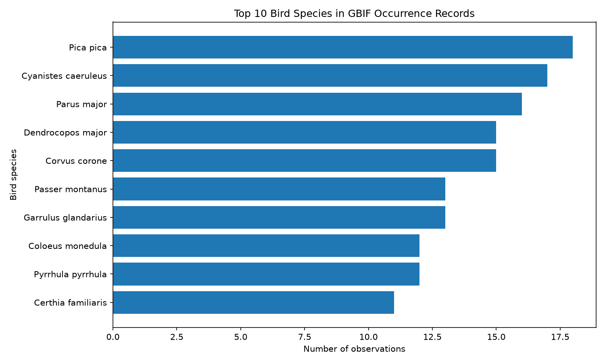

# Bird Observations



## The phenomenon

Bird observations are records of birds reported or collected in different places. I chose this phenomenon because bird species can be compared through numerical data, and the differences between species can be shown clearly in a chart. I wanted to see which bird species appeared most frequently in the GBIF occurrence records used for this project. The picture focuses on the number of observation records for each species. A higher bar means that the species appeared in more records in this dataset.

## The source

The data comes from the Global Biodiversity Information Facility (GBIF) Occurrence Search API:

https://api.gbif.org/v1/occurrence/search?taxonKey=212&limit=300

The query asks for bird records by using the bird taxon key 212. It requests up to 300 occurrence records. Each row in the JSON results represents one occurrence record. The records contain information such as the scientific name of the species. The number of observations is a count of records, not the number of individual birds. There is no measurement unit because the values represent record counts.

## What the picture shows

The picture shows the ten bird species with the highest number of occurrence records in the downloaded GBIF results. The bars are arranged from the lowest value at the bottom to the highest value at the top. The chart makes it easy to compare the frequency of the recorded species.

The picture hides several details. It only uses the 300 records returned by this API request, rather than all bird observations in GBIF. It also combines records with the same species name into one total, so it does not show the locations, dates, observers, or individual occurrence records. Records without a species name are not included in the chart.

## Run it

```text
uv run fetch.py
uv run plot.py
```