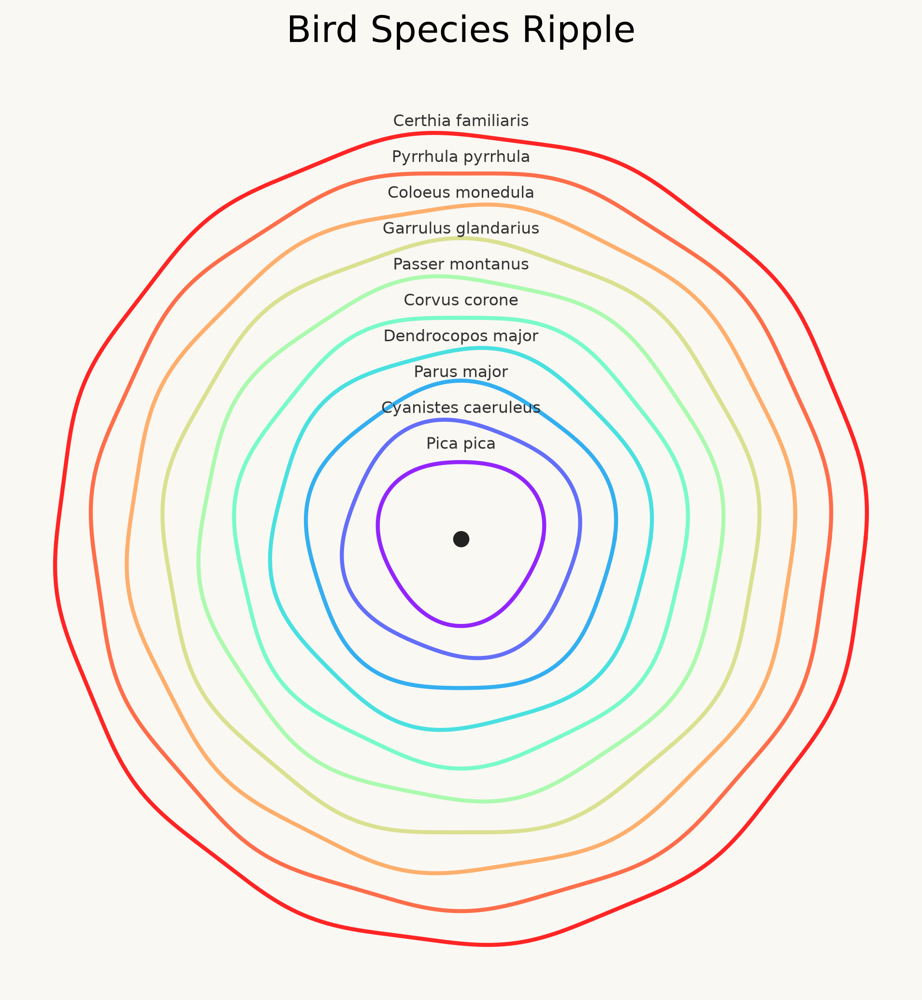

# Bird Observations



## The phenomenon

Bird observations are records of birds reported or collected in different places. I chose this phenomenon because bird species can be compared through numerical data, and differences between species can be transformed into visual patterns.

This project explores the frequency of bird species recorded in GBIF occurrence data. Instead of presenting the records as a traditional chart, the visualization transforms species observation counts into ripple patterns, allowing viewers to perceive differences between species through shape and structure.

## The source

The data comes from the Global Biodiversity Information Facility (GBIF) Occurrence Search API:

https://api.gbif.org/v1/occurrence/search?taxonKey=212&limit=300

The query uses the bird taxon key 212 and retrieves up to 300 bird occurrence records. Each record represents one observation event and contains information such as species name and occurrence details.

The number of observations represents the number of recorded occurrence records, not the number of individual birds. The dataset does not measure bird population size.

## What the picture shows

The picture shows the most frequently recorded bird species in the downloaded GBIF results through a ripple-based visualization.

Each ripple represents a bird species, and the patterns are generated from the frequency of recorded observations. The visualization converts numerical species records into circular structures, creating a different way to observe variations between species.

The picture also hides several details. It only represents the 300 records returned by this API request, rather than all bird observations in GBIF. It does not show the exact locations, dates, or individual observation events. Records without species information are not included.

## Run it

```text
uv run fetch.py

uv run ripple.py