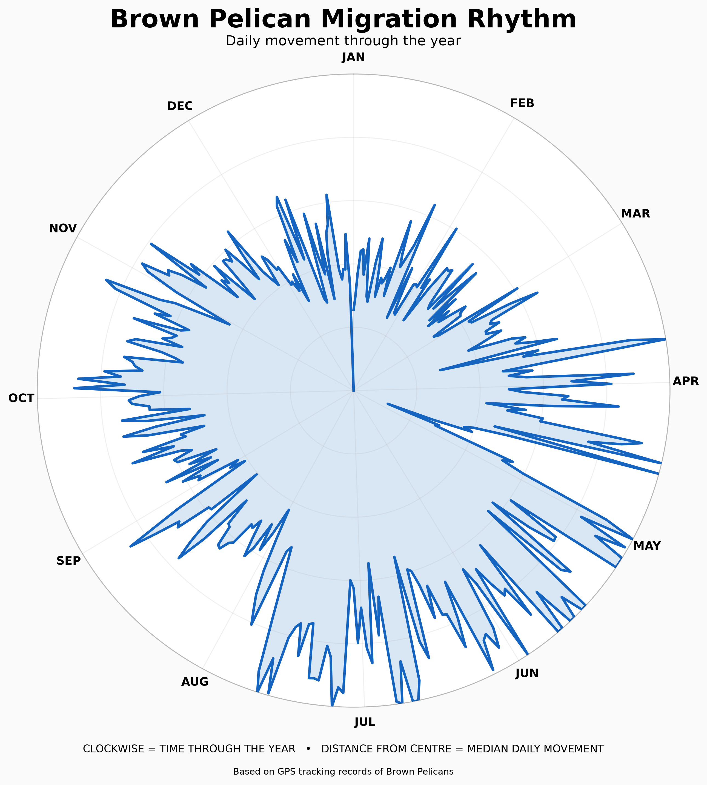
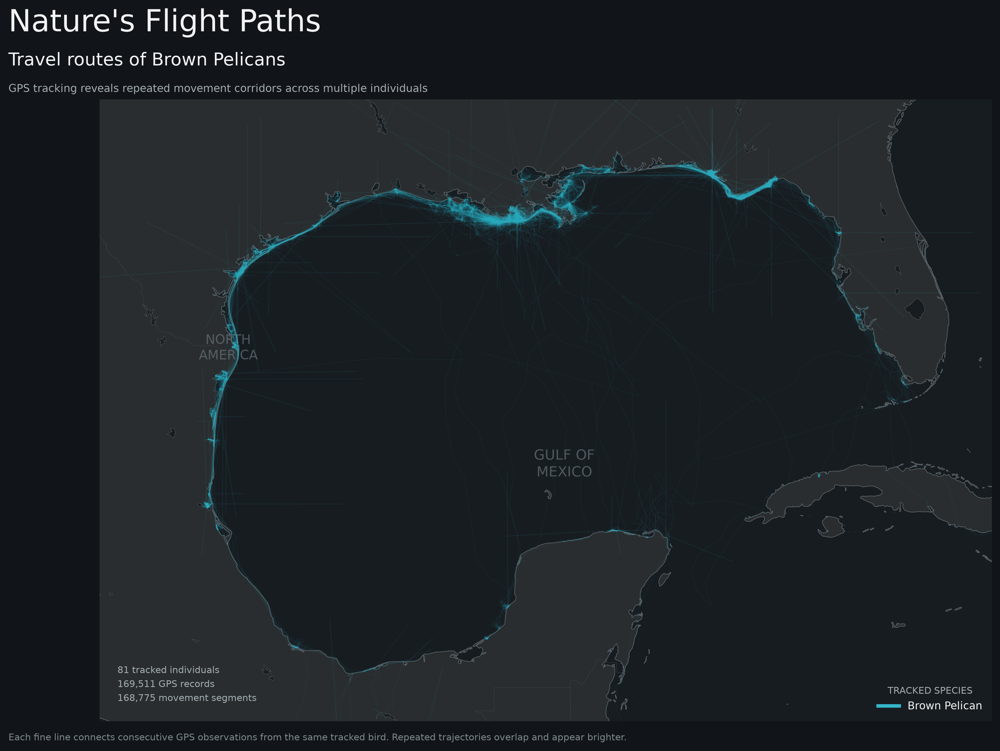
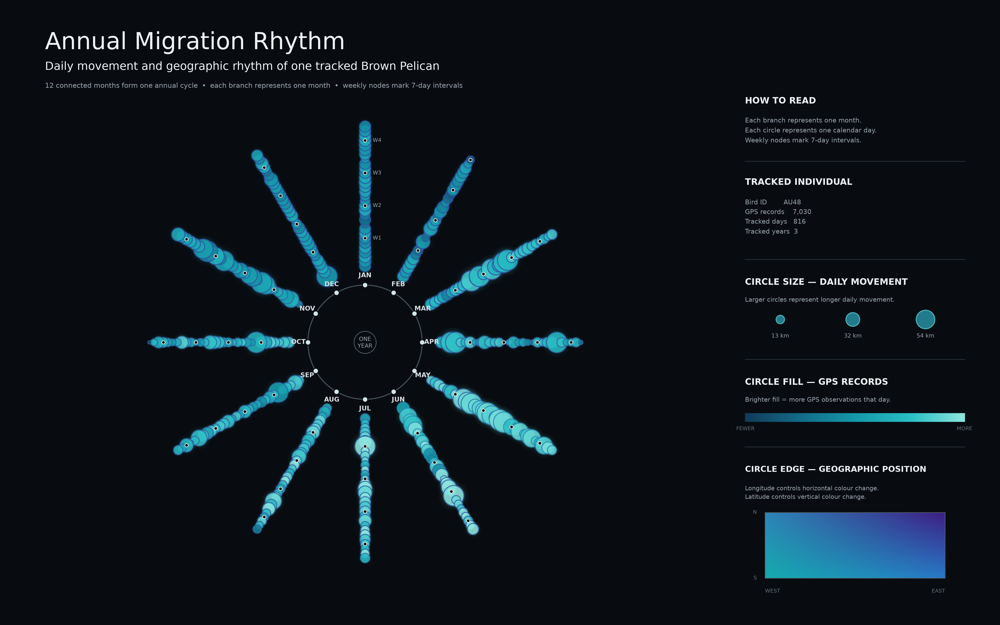
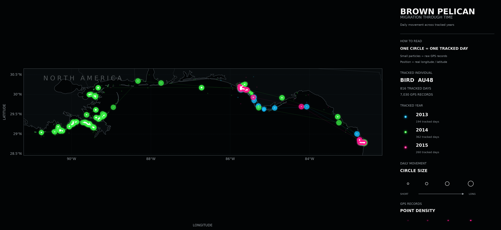

# Brown Pelican Migration Visualisation

## The Phenomenon

For this project, I explored bird migration using GPS tracking data.

I was interested in two main questions: how a bird's movement changes over time, and what its movement looks like geographically. During the process, I experimented with different ways of visualising time, daily movement distance, GPS records, longitude, and latitude.

Rather than deciding on one visual form at the beginning, the visualisation gradually changed as I developed a better understanding of the data.

---

## The Data Source

The migration data comes from the Movebank Data Repository.

For the Brown Pelican, I used:

**Brown pelican data from Lamb et al. (2017)**

The original dataset contains GPS tracking information such as timestamps, longitude, latitude, and individual bird IDs.

I initially collected datasets for two bird species: **Brown Pelican** and **White Stork**. My original idea was to show the movements of both species on the same map and compare their migration patterns.

However, after making an initial map, I found that their movement areas had very little spatial overlap. Showing both species on the same map required a much larger geographic range, which made their individual movement patterns difficult to see. Dense and overlapping routes also made it difficult to show changes in monthly movement and daily movement distance.

I therefore narrowed the project to one tracked individual, **Brown Pelican AU48**, so that I could explore its movement in greater detail.

---

## Visualisation Process

### 1. Exploring Movement Through Time

My first visualisation focused on time.

I wanted to understand how the bird's movement distance changed across different months. This helped me observe its movement rhythm over time.

However, the visualisation only showed when movement occurred. It did not show where the bird was actually travelling.

---

### 2. Moving from Time to Geographic Space

I then wanted to understand what the movement looked like geographically, so I moved from a time-based visualisation to a map.

The map made the spatial trajectory easier to understand. However, while adjusting the visualisation, I found that it was difficult to clearly show both the bird's daily movement distance and the number of GPS records at the same time.

Although the map showed the migration route, I felt that the information it communicated was still limited.

---

### 3. Adding More Data Dimensions

For the third experiment, I tried to combine more dimensions of the data into one visualisation.

I reorganised the data into a radial annual structure, with the twelve branches representing the twelve months. Each circle represents a tracked day. Circle size represents daily movement distance, while circle fill represents the number of GPS records. I also experimented with using the circle edges to encode geographic position through longitude and latitude.

This version allowed me to show more information at the same time, but it also became more complex to read.

At this stage, I went back to check the dataset more carefully. I had initially assumed from the dataset title that the selected records represented one year. However, I found that the selected bird actually contains **816 tracked days across 2013, 2014, and 2015**, and not every calendar day has a record.

This reminded me that the time coverage and composition of a dataset need to be checked carefully before deciding how to visualise it.

I also found that representing geographic position indirectly through the colour of the circle edges was not intuitive enough. This led me to return to a geographic map in the final iteration.

---

### 4. Returning to Geographic Space

For the final iteration, I returned to a geographic map and combined what I had learned from the previous experiments.

Instead of representing longitude and latitude indirectly through colour, I placed the GPS data directly according to its geographic coordinates.

The three tracked years are represented using different colours:

- **2013 — Blue**
- **2014 — Green**
- **2015 — Pink**

The larger circles represent tracked days, with circle size showing differences in daily movement distance. Smaller GPS points show recorded geographic positions and help reveal areas with repeated observations.

This final version attempts to connect time, movement distance, GPS records, and geographic position in a more direct visual form.

---

## What I Learned

This process made me realise that data visualisation is not only about finding a visual style. Each experiment helped me notice a different problem in either the data or the way I was representing it.

One of the most important lessons was the need to check the structure and time coverage of a dataset carefully. My understanding of the dataset changed during the visualisation process, and this directly influenced the final design.

I also found that obtaining and processing the data was relatively straightforward, while developing the visual style required much more experimentation.

I used ChatGPT to help translate my visual ideas into code and repeatedly adjusted the size, density, glow, layering, and visual mapping of the data points. This allowed me to quickly test different approaches, but it also revealed a limitation that I have not fully solved.

Although the dataset contains a large number of GPS records, the final map still does not appear as dense or visually impactful as my reference images. Repeated adjustments to the visual parameters did not fully achieve the effect I expected.

This made me realise that the problem may not simply be about visual styling. It may also relate to how the GPS data is spatially distributed, how overlapping records are aggregated, and how the data is mapped to visual elements.

In future iterations, I would like to investigate why a large dataset can still appear visually sparse and explore better ways to represent overlapping or highly concentrated GPS records without misrepresenting the original data.